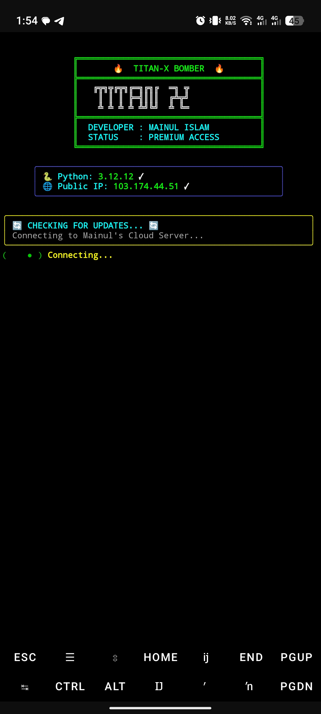
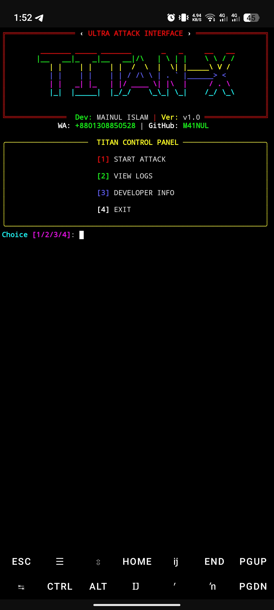
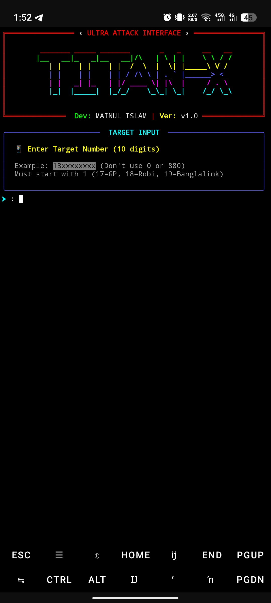
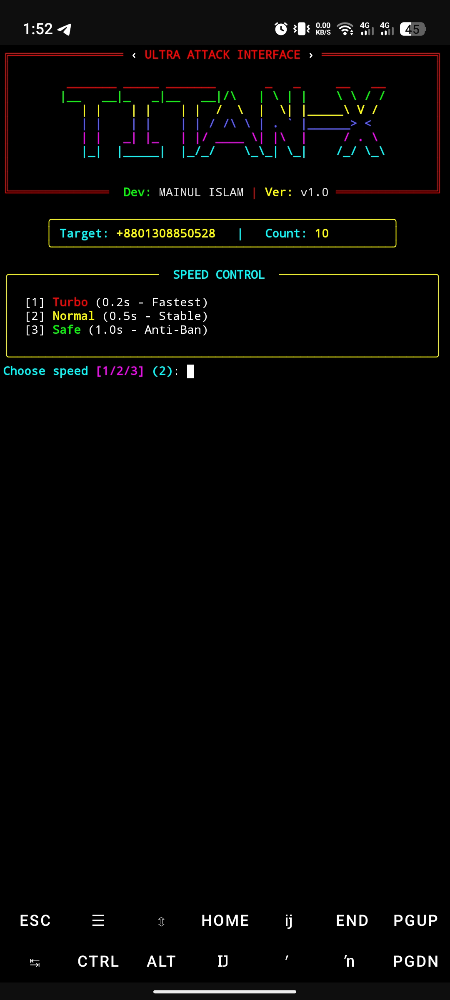
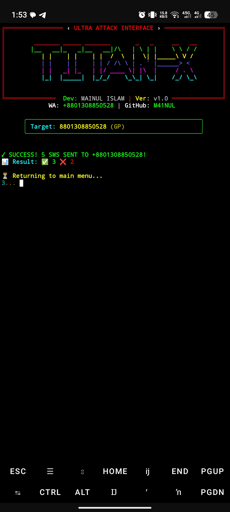

# 💣 TITAN-X BOMBER

<div align="center">
  
  
  
  
</div>

<p align="center">
  <b>Advanced SMS bombing tool with multiple working Bangladesh APIs.</b><br>
  Anti-block User-Agent rotation, beautiful UI. For Termux/Linux.
</p>

---

## 📱 About The Tool

TITAN-X BOMBER is a powerful and efficient SMS bombing tool designed for Termux and Linux platforms. It comes with a beautiful terminal UI and smart request handling system.

### ✨ Features
- ⚡ Multiple speed modes (Turbo, Normal, Safe)
- 🎨 Beautiful Rich Terminal UI
- 🔄 Anti-block User-Agent rotation
- 📊 Real-time attack statistics
- 📝 Attack logs viewer
- 🔔 Auto update checker

---

## 👨‍💻 Developer

| Information | Details |
|-------------|---------|
| **Name** | MAINUL ISLAM |
| **WhatsApp** | [+8801308850528](https://wa.me/8801308850528) |
| **GitHub** | [M41NUL](https://github.com/M41NUL) |
| **Email** | githubmainul@gmail.com |

---

## 📥 Installation

### For Termux:

```bash
pkg update && pkg upgrade -y
pkg install python git -y
rm -rf titan-x-bomber
git clone https://github.com/M41NUL/titan-x-bomber.git
cd titan-x-bomber
pip install requests pyfiglet rich
python titan_x_bomber.py
```

### For Linux:

```bash
sudo apt update && sudo apt upgrade -y
sudo apt install python3 python3-pip git -y
git clone https://github.com/M41NUL/titan-x-bomber.git
cd titan-x-bomber
pip3 install requests pyfiglet rich
python3 titan_x_bomber.py
```

---

## 🚀 How to Use

1. Run the tool: `python titan_x_bomber.py`
2. Select option **[1] START ATTACK**
3. Enter target number **(10 digits, without 0 or 880)**
4. Enter message count **(1-100)**
5. Choose speed mode:
   - **Turbo** (0.05s - Fastest)
   - **Normal** (0.4s - Stable)
   - **Safe** (1.0s - Anti-Ban)
6. Wait for completion

---

## 🎯 Menu Options

| Option | Description |
|--------|-------------|
| **[1] START ATTACK** | Begin bombing on target number |
| **[2] VIEW LOGS** | View previous attack logs |
| **[3] DEVELOPER INFO** | Contact and tool information |
| **[4] EXIT** | Exit the tool |

---

## 📸 Screenshots

| Startup | Main Menu | Target Input |
|:-------:|:---------:|:------------:|
|  |  |  |

| Speed Control | Attack Result |
|:-------------:|:-------------:|
|  |  |

---

## ⚠️ Disclaimer

> **This tool is for educational purposes only.**
>
> * Developer is not responsible for any misuse.
> * Use only on your own numbers for testing.
> * Misuse may lead to legal consequences.

---

## 🔄 Update

```bash
cd titan-x-bomber
git pull
python titan_x_bomber.py
```

---

## 📞 Contact

If you have any issues or feature requests, feel free to contact:

- **WhatsApp:** [+8801308850528](https://wa.me/8801308850528)
- **GitHub:** [M41NUL](https://github.com/M41NUL)
- **Email:** githubmainul@gmail.com

---

## ⭐ Support

If you like this tool, don't forget to give a star on GitHub! ⭐

---

## 📄 Copyright

```
╔══════════════════════════════════════════════════╗
║         © 2026 MAINUL - X. All rights reserved.   ║
║     Unauthorized reproduction or distribution     ║
║              is strictly prohibited.               ║
╚══════════════════════════════════════════════════╝
```

<p align="center">
  <b>Made with ❤️ in Bangladesh</b>
</p>
